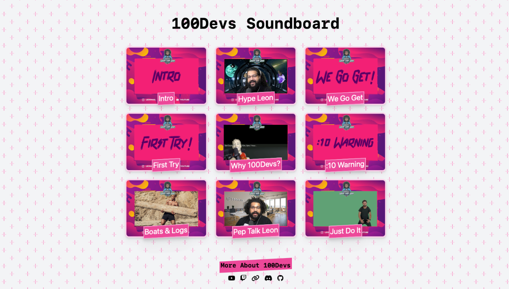
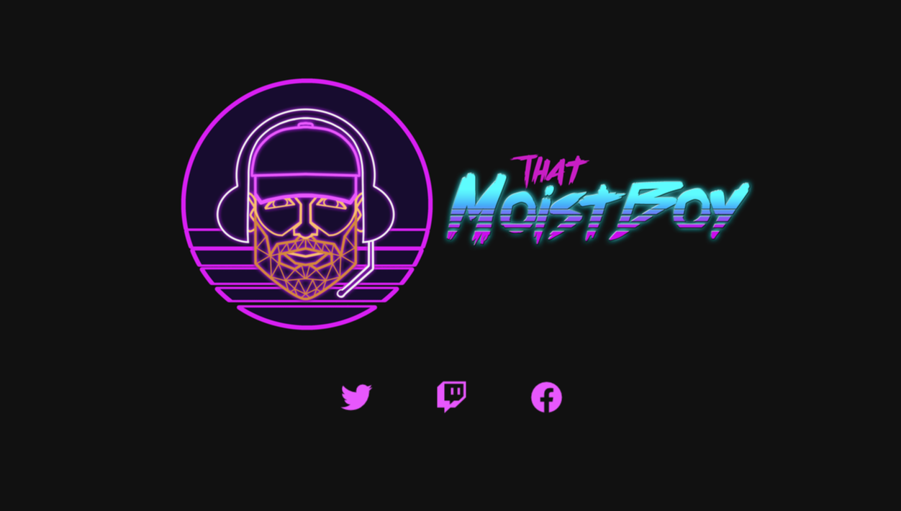

    
    

<h3>👋 Greetings!</h3>
My love for coding is a love for solving problems. There's nothing better than finding a solution for what seems like an impossible challenge. And I found my passion for teaching and leading when I coached high school rowing for twelve seasons. I’m at my best when I’m able to share my knowledge and help elevate the work around me. 
  

<h3>🔌 Shameless Plug: Recycle your Electronics!</h3>
Did you know that only 22% of U.S. electronic waste is recycled? That means the average American landfills about 44 pounds of e-waste a year. I spent over five years in the electroncis reycling industry. 
  AMA! And find a certified electronics recycler near you: <a href="https://sustainableelectronics.org/find-an-r2-certified-facility/">R2 Certified Recyclers</a> or <a href="https://e-stewards.org/find-a-recycler/">e-Stewards Certified Recyclers</a>.
  

<h3>⚡ My Work</h3>
<table width="100%" bordercolor="#66b2b2">
  <tr>
      <td width="50%" valign="top">
          <h3 align="center">Off to Sleep Website</h3>
           
          
           
          

              
              
          

          
<b>HTML, CSS, Figma</b>: Complete design and launch of new infant sleep consulting business, Off to Sleep.

      </td>
      <td width="50%" valign="top">
          <h3 align="center">100Devs Soundboard</h3>
           
          
           
          

              
              
          

          
<b>React, Tailwind</b>: soundboard that recreates some favorite moments of 100Devs. Created with React and Tailwind; used CSS Grid to layout the soundboard buttons.

      </td>
  </tr>
  <tr>
      <td width="50%" valign="top">
          <h3 align="center">Twitch Streamer Landing Page</h3>
           
          
           
          

              
              
          

          
<b>HTML, CSS</b>: landing page for Twitch Streamer, ThatMoistBoy. Includes links to Twitch page and social media pages.

      </td>
      <td width="50%" valign="top">
          <h3 align="center">Green Earth Website</h3>
           
          
           
          

              <!-- -->
          

          
<b>HTML, CSS, Figma, Wix</b>: Redesigned and launched a new company website to modernize the design, made the website responsive, and updated the copy to be SEO friendly and better advertise the available services.

      </td>
  </tr>
</table>

<h3>🏋️ Code Challenges</h3>

<h4>Code Wars</h4>

<a href="https://www.codewars.com/users/matt-conn/completed_solutions">Code Wars Solutions</a>

<h4>LeetCode</h4>
<a href="https://leetcode.com/matt-conn/">LeetCode Solutions</a>
